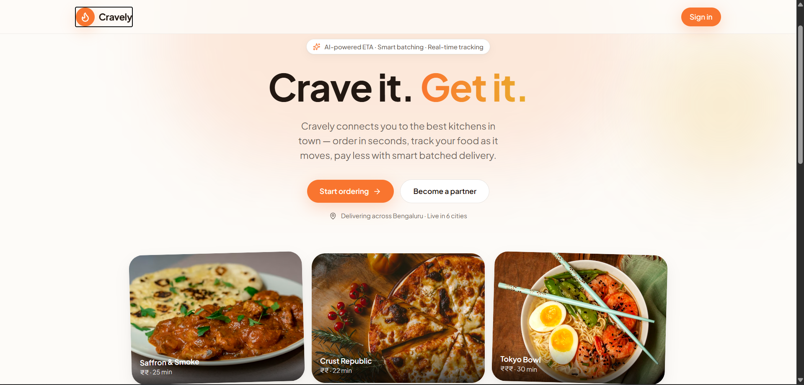
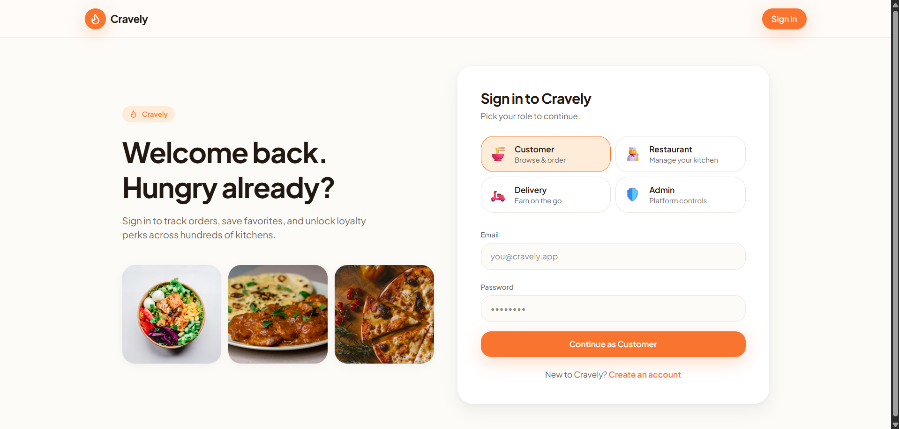
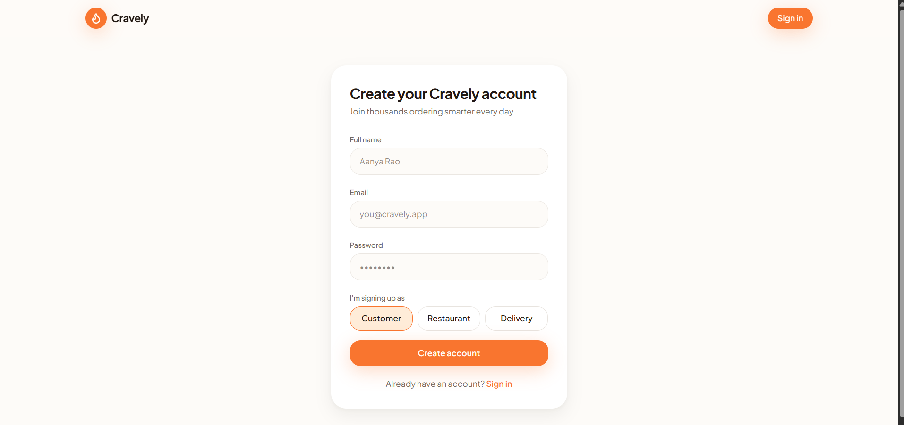

# 🥗 Cravely — Multi-Vendor Food Ordering Marketplace

Cravely is a full-stack, production-ready multi-vendor food ordering platform designed to bridge the gap between restaurants, customers, and delivery partners. Built with a modern tech stack, it offers a seamless, real-time experience for browsing menus, placing orders, and tracking deliveries.



## 🚀 Features

### 👤 Customer App
- **Intuitive Discovery**: Browse restaurants by location, cuisine, ratings, and price levels.
- **Dynamic Cart**: Real-time cart management with instant price calculations.
- **Order Tracking**: Track your food from preparation to your doorstep.
- **Secure Payments**: Integrated wallet and payment simulation (UPI/Card/COD).
- **Ratings & Reviews**: Share feedback and rate your favorite kitchens.

### 🏪 Vendor Dashboard
- **Menu Management**: Full control over items, images, availability, and pricing.
- **Live Order Stream**: Real-time notifications for new orders with accept/reject flow.
- **Sales Analytics**: Insightful reports on sales performance and customer trends.
- **Kitchen Status**: Toggle restaurant open/close status with one click.

### 🚴 Delivery Partner
- **Nearby Requests**: Receive delivery requests based on proximity.
- **Real-time Navigation**: Navigate to restaurant and customer locations.
- **Status Updates**: Update order status from "Picked Up" to "Delivered".



## 🛠 Tech Stack

- **Frontend**: React, Vite, Tailwind CSS, TanStack Router & Query, Lucide Icons.
- **Backend**: Java 17, Spring Boot 3.2.5, Spring Security (JWT).
- **Database**: PostgreSQL (Persistence), Hibernate (ORM).
- **Styling**: Vanilla CSS + Tailwind for premium, responsive design.

---

## 🛠 Setup & Installation

### 1. Backend Setup
1. Navigate to the `backend` directory.
2. Create a `.env` file with your PostgreSQL credentials:
   ```env
   DB_URL=jdbc:postgresql://localhost:5432/cravely_db
   DB_USERNAME=your_username
   DB_PASSWORD=your_password
   JWT_SECRET=your_jwt_secret
   SERVER_PORT=8081
   ```
3. Run the application:
   ```powershell
   .\run.ps1
   ```

### 2. Frontend Setup
1. Navigate to the `frontend` directory.
2. Install dependencies:
   ```bash
   npm install
   ```
3. Start the development server:
   ```bash
   npm run dev
   ```

### 3. Seeding the Database
To populate the app with sample data, run the `seed.sql` script located in the `backend` folder:
```powershell
$env:PGPASSWORD = 'your_password'; psql -U postgres -d cravely_db -f seed.sql
```



## 🏗 Architecture
The system follows a **Modular Monolith** architecture with a clear separation between the API layer, Service layer, and Persistence layer. Real-time updates are handled via optimized polling/sockets, ensuring low latency for order status changes.

---
*Developed for the Multi-Vendor Food Marketplace Challenge.*
